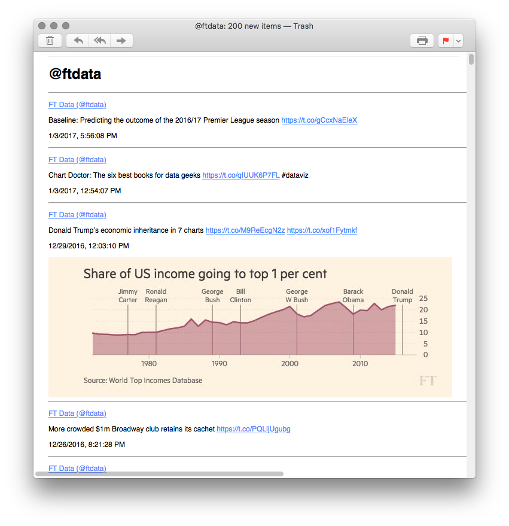

# tweetletter

Send Twitter feed updates via email

## Getting started

    node tweetletter.js /path/to/config.json /path/to/state.json

## Sample config

Get Twitter API keys from [apps.twitter.com](https://apps.twitter.com).

    {
      "smtp": {
        "from": "tweetletter@example.org",
        "to": "tweetletter@example.org",
        "host": "smtp.example.org",
        "user": "user",
        "pass": "pass"
      },
      "api": {
        "consumer_key": "deigeip2EiFah4Wae3ahpaeh5aijiey9",
        "consumer_secret": "phahroh9ki1gie3Ahx0peethoi2sae7a",
        "access_token": "ohth6peekoosei6aeS8Pohqu1niePh5d",
        "access_token_secret": "osei5Hai5Goo2ox1muevoophe0she2lo"
      }
    }
